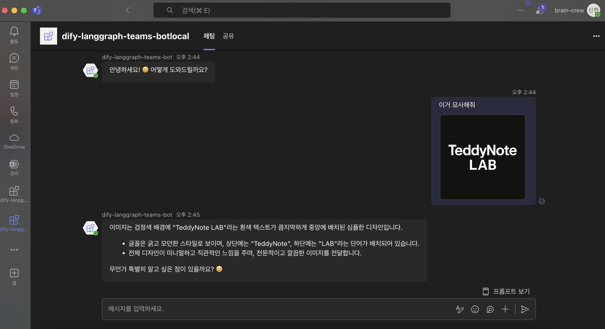
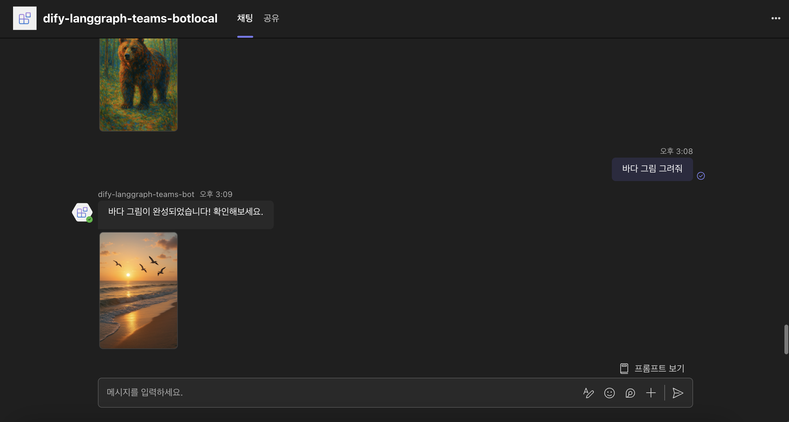
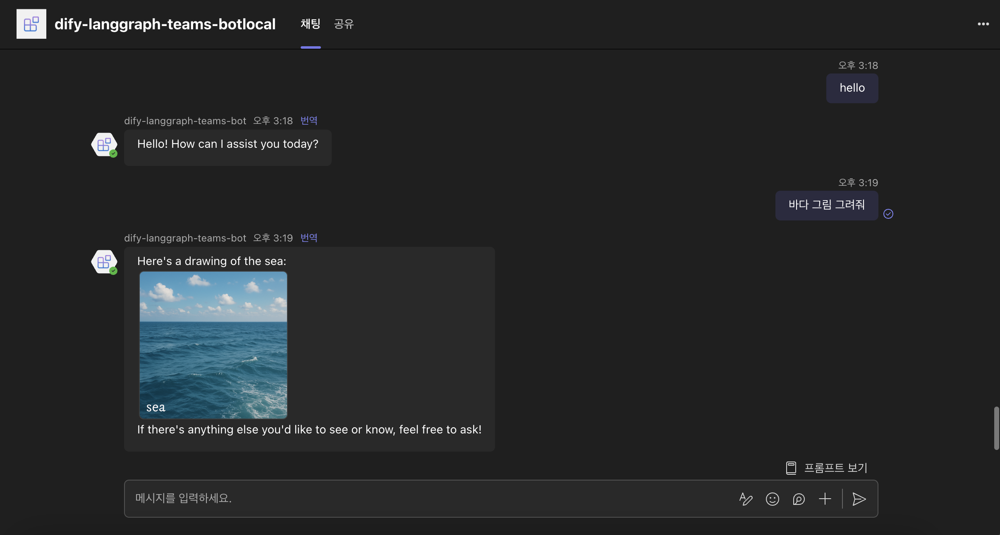

# 🎾 Dify LangGraph Teams Bot UseCase

Dify 와 LangGraph API 를 Teams 에 통합하는 유스케이스

## 기능 미리보기

- 이미지 업로드 / 비전
  
- Dify 이미지 생성
  
- LangGraph 이미지 생성
  

## 기본 봇 템플릿 시작하기

> **필수 조건**
>
> 로컬 개발 환경에서 이 템플릿을 실행하려면 다음이 필요합니다:
>
> - [Node.js](https://nodejs.org/), 지원 버전: 18, 20, 22
> - [Teams Toolkit Visual Studio Code 확장](https://aka.ms/teams-toolkit) 버전 5.0.0 이상 또는 [Teams Toolkit CLI](https://aka.ms/teamsfx-toolkit-cli) (Cursor / WindSurf 가능)

### 프로젝트 설치

Clone 혹은 Use this Template 을 통해 해당 레포지토리를 받아주세요.

```bash
git clone
cd dify-langgraph-teams-bot
```

루트 디렉토리의 `.localConfigs.example` 을 복사해서 `.localConfigs` 파일로 만들어주세요.

### 프로젝트 열기

> Teams Toolkit CLI를 사용한 로컬 디버깅을 위해서는 [Teams Toolkit CLI 로컬 디버깅 설정](https://aka.ms/teamsfx-cli-debugging)에 설명된 추가 단계가 필요합니다.

1. 먼저 VS Code 툴바 왼쪽의 Teams Toolkit 아이콘을 선택합니다.
2. F5를 눌러 디버깅을 시작하면 웹 브라우저를 사용하여 Teams App Test Tool에서 앱이 실행됩니다. `Debug in Test Tool`을 선택하세요.
3. 브라우저가 팝업되어 Teams App Test Tool이 열립니다.
4. 봇으로부터 환영 메시지를 받게 되며, 봇에 아무 메시지나 보내면 에코 응답을 받을 수 있습니다.

**축하합니다**! 이제 Teams App Test Tool에서 사용자와 상호작용할 수 있는 애플리케이션이 실행 중입니다:


### LangGraph 봇 사용하기

루트 디렉토리의 `index.tx` 최하단을 확인해주세요.
langgraphBot 을 주석 해제하고, difyBot 을 주석처리 해주세요.

## 템플릿에 포함된 내용

| 폴더         | 내용                                  |
| ------------ | ------------------------------------- |
| `.vscode`    | 디버깅을 위한 VSCode 파일             |
| `appPackage` | Teams 애플리케이션 매니페스트 템플릿  |
| `env`        | 환경 설정 파일                        |
| `infra`      | Azure 리소스 프로비저닝을 위한 템플릿 |

다음 파일들은 커스터마이징이 가능하며 시작하기 위한 예제 구현을 보여줍니다.

| 파일              | 내용                                                    |
| ----------------- | ------------------------------------------------------- |
| `difyBot.ts`      | Dify 연동을 위한 봇 입니다.                             |
| `langgraphBot.ts` | LangGraph 연동을 위한 봇 입니다.                        |
| `index.ts`        | `index.ts`는 기본 봇을 설정하고 구성하는 데 사용됩니다. |

다음은 Teams Toolkit 특정 프로젝트 파일입니다. Teams Toolkit의 작동 방식을 이해하려면 [Github의 완전한 가이드](https://github.com/OfficeDev/TeamsFx/wiki/Teams-Toolkit-Visual-Studio-Code-v5-Guide#overview)를 방문하세요.

| 파일                    | 내용                                                                                                                |
| ----------------------- | ------------------------------------------------------------------------------------------------------------------- |
| `teamsapp.yml`          | 이는 주요 Teams Toolkit 프로젝트 파일입니다. 프로젝트 파일은 두 가지 주요 사항을 정의합니다: 속성과 구성 단계 정의. |
| `teamsapp.local.yml`    | 이는 `teamsapp.yml`을 로컬 실행 및 디버깅을 가능하게 하는 작업으로 재정의합니다.                                    |
| `teamsapp.testtool.yml` | 이는 `teamsapp.yml`을 Teams App Test Tool에서 로컬 실행 및 디버깅을 가능하게 하는 작업으로 재정의합니다.            |

## 기본 템플릿 확장하기

다음 문서들은 기본 템플릿을 확장하는 데 도움이 될 것입니다.

- [환경 추가 또는 관리](https://learn.microsoft.com/microsoftteams/platform/toolkit/teamsfx-multi-env)
- [다중 기능 앱 생성](https://learn.microsoft.com/microsoftteams/platform/toolkit/add-capability)
- [앱에 단일 로그인 추가](https://learn.microsoft.com/microsoftteams/platform/toolkit/add-single-sign-on)
- [Microsoft Graph에서 데이터 접근](https://learn.microsoft.com/microsoftteams/platform/toolkit/teamsfx-sdk#microsoft-graph-scenarios)
- [기존 Microsoft Entra 애플리케이션 사용](https://learn.microsoft.com/microsoftteams/platform/toolkit/use-existing-aad-app)
- [Teams 앱 매니페스트 커스터마이징](https://learn.microsoft.com/microsoftteams/platform/toolkit/teamsfx-preview-and-customize-app-manifest)
- [클라우드 리소스 프로비저닝](https://learn.microsoft.com/microsoftteams/platform/toolkit/provision) 및 [코드를 클라우드에 배포](https://learn.microsoft.com/microsoftteams/platform/toolkit/deploy)하여 Azure에서 앱 호스팅
- [앱 개발 협업](https://learn.microsoft.com/microsoftteams/platform/toolkit/teamsfx-collaboration)
- [CI/CD 파이프라인 설정](https://learn.microsoft.com/microsoftteams/platform/toolkit/use-cicd-template)
- [조직 또는 Microsoft Teams 앱 스토어에 앱 게시](https://learn.microsoft.com/microsoftteams/platform/toolkit/publish)
- [Teams Toolkit CLI로 개발](https://aka.ms/teams-toolkit-cli/debug)
- [모바일 클라이언트에서 앱 미리보기](https://aka.ms/teamsfx-mobile)
